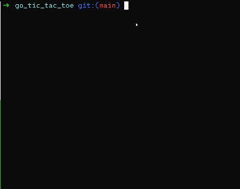

# Practice

## Demo

## Goal
This is an entry level practice for Go, my goal is to practice using struct, method, etc.
Small projects are best the way to learn a language, there is no project too small.
